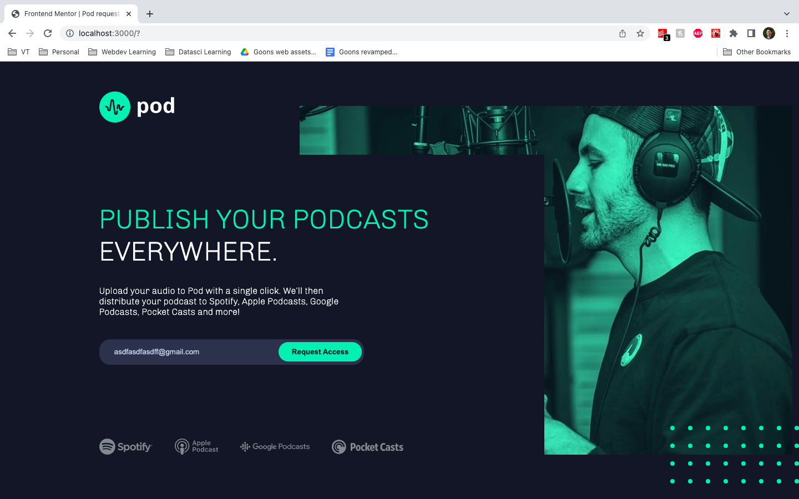

# Frontend Mentor - Pod request access landing page solution

This is a solution to the [Pod request access landing page challenge on Frontend Mentor](https://www.frontendmentor.io/challenges/pod-request-access-landing-page-eyTmdkLSG). Frontend Mentor challenges help you improve your coding skills by building realistic projects. 

## Table of contents

- [Overview](#overview)
  - [Screenshot](#screenshot)
  - [Links](#links)
- [My process](#my-process)
  - [Built with](#built-with)
  - [Useful resources](#useful-resources)
- [Author](#author)

## Overview

### Screenshot

### Links

- Solution URL: [GitHub](https://github.com/wongd-hub/fm-pod-landing-page)
- Live Site URL: [Vercel](https://fm-pod-landing-page-ppehmin96-wongd-hub.vercel.app/)

## My process

### Built with

- Semantic HTML5 markup
- CSS custom properties
- Flexbox
- CSS Grid
- [React](https://reactjs.org/) - JS library
- [Next.js](https://nextjs.org/) - React framework

### Useful resources

- [CSS SVG Hex to Filter](https://codepen.io/sosuke/pen/Pjoqqp)
## Author

- Website - [Darren W.](https://github.com/wongd-hub/)
- Frontend Mentor - [@wongd-hub](https://www.frontendmentor.io/profile/wongd-hub)